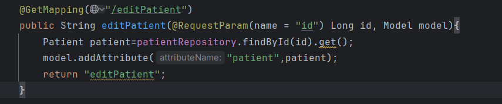

# GUINDO BADARA ALIOU MSDIA FSM
### MASSAR 2100000017

# TP 3 PARTIE 2

## Introduction

Dans cette deuxième partie du TP, nous avons amélioré l'interface utilisateur en introduisant un système de template avec **Thymeleaf Layout Dialect**, et ajouté la **validation de formulaire** à l’aide des annotations de validation de Spring.  
L'objectif est de mutualiser l'affichage des vues grâce à un layout commun (`template1.html`) et de garantir la validité des données saisies par l'utilisateur lors de la création ou de la modification d'un patient.

---

## Mise en place d’un template global

Création de la page `template1.html` :

  

Décoration de la page `patient.html` via le layout :

Le fichier `template1.html` contient une **structure commune** (barre de navigation, inclusion Bootstrap via WebJars, fragment `content1`).  
Les autres pages s’intègrent dynamiquement dans ce template avec `layout:decorate="template1"`.

---

## Ajout d'un formulaire avec Thymeleaf

Création d'une page Thymeleaf pour ajouter un patient avec formulaire HTML.

Utilisation de `layout:decorate` pour intégrer le formulaire dans `template1.html`.  
Les champs du formulaire sont liés à l’objet `patient`, avec gestion des erreurs via `th:errors`.

  

---

## Validation des champs

Ajout d’une dépendance dans `pom.xml` pour activer la validation :

Exemples d’annotations utilisées :
- `@NotEmpty` : champ obligatoire
- `@Size(min = 2, max = 50)` : taille du nom
- `@DecimalMin("100")` : score minimum

Ces validations sont automatiquement prises en charge lors de la soumission du formulaire.

  

---

## Modification des patients

Ajout d'une méthode `editPatient` dans le contrôleur.  
Elle récupère un patient par `id`, l’ajoute au modèle, puis charge une vue avec formulaire prérempli (`editPatient.html`).

Cela permet la **réutilisation du formulaire** pour la création et la modification.

---

## Gestion des redirections

Mise en place d’une logique de redirection correcte après modification ou création, pour conserver le contexte de navigation.

---

## Conclusion

Grâce à cette deuxième partie du TP, nous avons introduit une base solide pour maintenir une application web modulaire et cohérente :

- Un **template global** qui permet une interface homogène pour toutes les pages.
- Des **formulaires dynamiques** basés sur Thymeleaf.
- Une **validation automatique** des champs, garantissant la fiabilité des données.

Ces éléments permettent de renforcer à la fois l’**ergonomie** et la **robustesse** de l'application.

